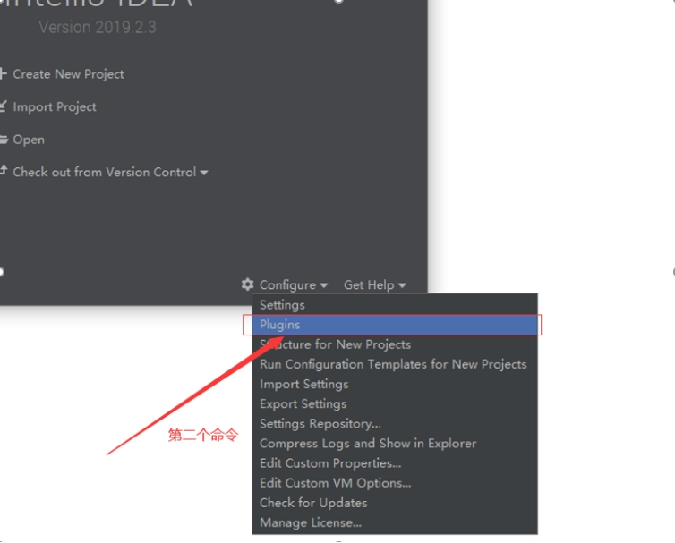

# **Idea30天无限激活图文教程**

前提：自行找到一个短期密钥进入idea，再进行以下操作

## 1. 第1步

双击打开该程序，进入如下图界面

 

## 2. 第2步

执行了步骤一过后，进入此界面，相关操作如下

 

 

## 3. 第3步

重新选择路径，选择压缩包所在的文件夹路径，最后选择该压缩文件，点击OK即可

 

 

## 4. 第4步

选择“IDE Eval Reset”，点击Restart IDE。最后在弹出的对话框中点击“Restart按钮”

 

## 5. 第5步

执行完上一步操作过后，我们进入了此界面，执行下面相关操作

 

 

##  6. 第6步

执行完上一步的操作，再依次执行下面图中“第一步、第二部、第三部”，就完成了30天的激活。

 

***\*PS：就这样操作就OK了。\****